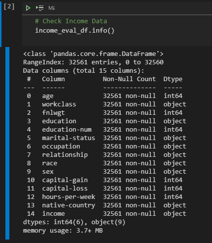

*INCOME CLASSIFICATION PROJECT*

**Focus**   
Examination of 1994 Census Income data in an attempt to predict whether an individual's income will exceed $50,000.00 per annum based on a variety of factors such as education, age, marital status, relationship status and work classification.  

**Dataset**   
This project utilized a    
dataset.     

The raw data was downloaded as a single csv.  The raw data revealed 32561 rows distributed throughout 15 columns.  Columns consisted of the following:  

 

**Machine Learning**   

- [Scikit-Learn](https://scikit-learn.org/stable/)
- [Flask v1.0.2](http://flask.pocoo.org/)
- [Jinja2](http://jinja.pocoo.org/docs/2.10/)

Project By:  
Connor MacKenzie 
Ismahan Adan 
Michelle Fegatelli 

