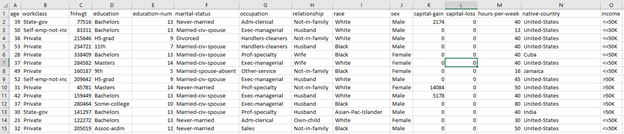
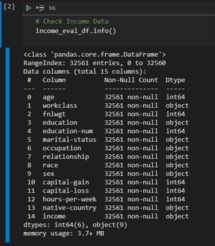
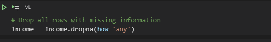
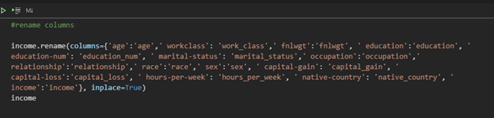

*INCOME CLASSIFICATION PROJECT*

**Focus**   
Examination of 1994 Census Income data in an attempt to predict whether an individual's income will exceed $50,000.00 per annum based on a variety of factors such as education, age, marital status, relationship status and work classification.  The big question, can we use machine learning to predict one's income.  The inflation rate in the United States between 1994 and today has been 78.84%, which translates into a total increase of $78.84. This means that 100 dollars in 1994 is equivalent to 178.84 dollars in 2021.  $89,420.00.

**Dataset**   
This project utilized a dataset.     

The raw data was downloaded as a single csv.  The raw data revealed 32561 rows distributed throughout 15 columns.  Columns consisted of the following data types:  

**Cleaning and Preparing the Data**   

The data was first cleand by dropping all rows with any missing information.   
Columns were then renamed.  

The data was regrouped, categorized, labled for models toe be run on and most importanly, the removal of of random spaces before, after and between the values.  

**Machine Learning, Decision Trees, Linear Regression and Neural Networks**   

Libraries were imported.  
- [Scikit-Learn](https://scikit-learn.org/stable/)   

Data was was read in and viewed.  It was then divided into attributes and labels and the further divided in to training and test sets.    
 
.png) 
.png) 
.png) 

From the sklearn module we used the LinearRegression method to create a linear regression object.

.png) 

The object was then fit, trained tested and plotted. 
.png) 

Hosted by:
- [Heroku](https://www.heroku.com/)   

Project By:  
- [Connor MacKenzie](https://github.com/amerikonnor/) 
- [Ismahan Adan](https://github.com/ismahanadan/) 
- [Michelle Fegatelli](https://github.com/MichFig/)  

Project page: https://amerikonnor-incomeclassproject.herokuapp.com/

